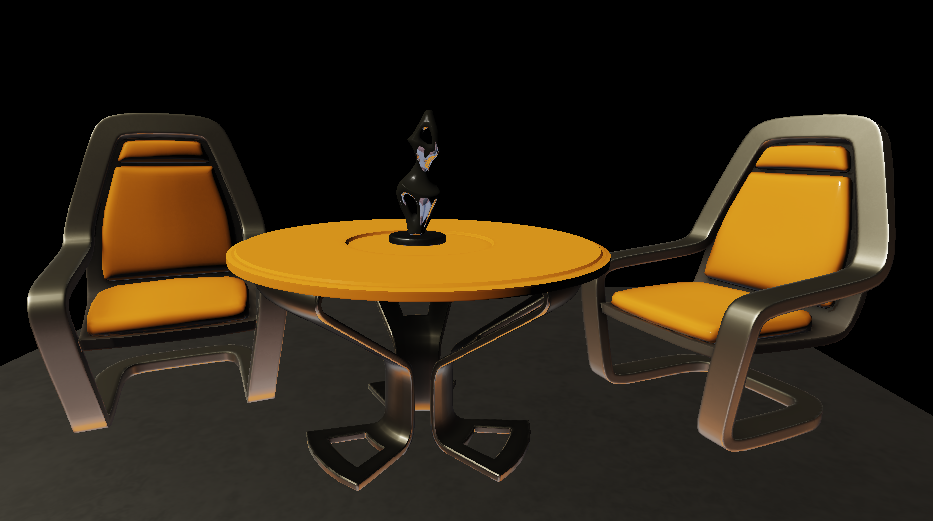

# actiniaria
    God is in his heaven, all is right with the world.

## Requirement
0. You need to know **How** to add a plugin into UE4 project
1. UE4 language setting is **English**
2. Need  **Camera** in UE4 Level
3. d3d12 SDK required ( on win7, you need to prepare extra dll by yourself, see more about [D3D12On7](https://microsoft.github.io/DirectX-Specs/d3d/D3D12onWin7.html))
4. Check if the submodule is pulled down completely;

## Todo
- Generation of shader from Material Graph
- Skylight 
- Multi-Materials 
- Shadow
- Reflection
- Volumtic fog
- Test other scene

## Preview
